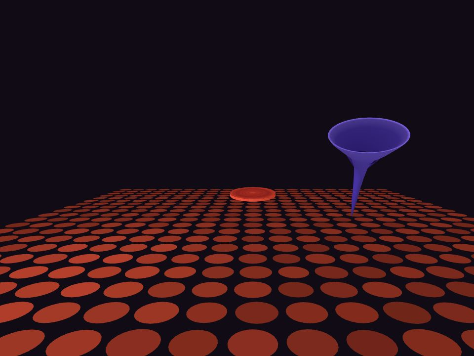

# THE GAME

An AI-assisted WebXR fan prototype that turns the fictional headset game from *Star Trek: The Next Generation* into a small, playable mixed-reality experiment for Meta Quest 3.

[](https://hits.sh/github.com/thehillbeyondthisone/theGame/)

## Play it

**[Launch THE GAME in your browser →](https://thehillbeyondthisone.github.io/theGame/)**

The hosted build works on desktop, mobile, and Quest Browser. On Quest, open the link directly in the headset and choose **Put it on**. No install or account is required.

Guide a red disc into a shifting violet funnel. On Quest, you can play hands-free by aiming with your head and leaning to adjust depth; hand tracking and controllers provide more direct alternatives. A mouse/touch version and Meta's desktop headset emulator make development possible without wearing the headset.



> **Prototype status:** ten repeatable layouts, a mobile-first 60-second score run, and untimed free play are playable. Automated and emulated-touch checks pass; physical phone/Quest feel, sustained performance, comfort, and long-term fun still need human playtesting. This is a development build, not a finished release.

## What is playable

- **Mind mode:** hold your gaze near the funnel mouth to draw the disc forward; lean to adjust depth.
- **Hand tracking:** open-palm pull, pinch-and-release throw, and palm shove.
- **Controllers:** trigger tractor beam, stick depth control, throws, and haptic feedback.
- **60-second flow run:** the timer starts on your first drag. Sinks earn 100 points, centered entries without a rim hit earn 200, and every three consecutive clean sinks raises the multiplier up to ×4. Rim hits break the streak without removing points. Finish to save your personal best on this browser, then replay in one tap.
- **Mobile:** drag anywhere, then hold your finger or the marker above it over the cone’s mouth. The marker locks onto the center nearby; keep holding to approach and sink. Push/Pull buttons or a two-finger pinch give manual depth control. Pause and Reset are on screen; leaving the page pauses a run until you resume.
- **Free play:** the same layouts and feedback without a timer. Switch between free play and score runs with the on-screen mode button (switching starts a fresh session).
- **Desktop:** drag the disc; use the wheel or Push/Pull for depth.
- **Ten layouts:** funnels become smaller and begin to move. A sink plays a capture spiral before the next level.

All four control methods produce the same small `Intent` data structure. A deterministic simulation owns capture, rebound, and progression, while rendering and device input stay at the edges. That separation has made the project unusually easy to test even though WebXR hardware itself is not fully automatable.

## Quick start on Windows

Install [Node.js](https://nodejs.org/), clone the repository, then double-click `quickstart.bat` or run:

```powershell
git clone https://github.com/thehillbeyondthisone/theGame.git
cd theGame
npm ci
.\quickstart.bat
```

The launcher defaults to **Quest mode**: HTTPS on your local network, starting at port 5173 and moving upward if the port is occupied. Open the printed `Network` URL in Quest Browser on the same Wi-Fi, accept the self-signed development certificate, then choose **Put it on**.

Other launcher modes:

```powershell
.\quickstart.bat desktop   # plain HTTP on localhost
.\quickstart.bat emulate   # desktop Quest 3 emulator
.\quickstart.bat test      # unit tests
.\quickstart.bat check     # typecheck, tests, build, size budgets
```

You can also use the npm scripts directly:

| Command | Purpose |
| --- | --- |
| `npm run dev` | LAN HTTPS development server for a Quest |
| `npm run dev:local` | localhost desktop server |
| `npm test` | simulation, controls, comfort, and renderer-regression tests |
| `npm run build` | TypeScript check and production build |
| `npm run size` | enforce the Quest download budgets after a build |

## Controls

| Mode | Input |
| --- | --- |
| Mind (default in XR) | Look toward the destination. Hold near the funnel mouth to advance; lean in/back for manual depth. |
| Hands | Open palm to pull, pinch to hold, release while moving to throw, or shove with the palm. |
| Controllers | Trigger to pull, stick to change depth, release during a flick to throw. A/X resets; B/Y toggles stats. |
| Mobile | Drag with one finger; hold your finger or the marker above it over the funnel mouth. Keep holding when the aim locks to approach and sink. Hold Push/Pull or use a two-finger pinch for manual depth. On-screen Pause/Reset. |
| Desktop | Drag. Wheel or Push/Pull changes depth. `R` resets; `H` toggles stats; Space pauses. |

## How AI was used

This was built through human-directed, agent-assisted programming—not by a one-shot game generator, and there is no generative AI in the running game. The human set the concept, feel, reference target, constraints, and acceptance calls. Coding agents helped research browser/XR tradeoffs, propose architecture, implement TypeScript, write tests and documentation, and investigate failures. Every generated change still had to survive source review and the project checks; hardware and visual claims remain explicitly unverified until a person tests them.

Read [AI development and verification](docs/AI-DEVELOPMENT.md) for the workflow, failure boundaries, and lessons suitable for discussion on `/r/aigamedev`.

## Project map

| Path | What lives there |
| --- | --- |
| `src/sim` | deterministic world state, comfort limits, capture, rebound, and level progression |
| `src/input` | mind, hands, controller, and pointer adapters that emit shared intents |
| `src/view` | super-three rendering, shapes, HUD, and the Quest multiview patch |
| `src/platform` | WebXR session, haptics, audio, and Meta Web Launch integration |
| `src/dev` | desktop headset-emulator setup, excluded from production behavior |
| `docs` | decisions, tuning, roadmap, visual-review method, and public development notes |

The broader concept and milestone plan are in [PLAN.md](PLAN.md). Engineering decisions are recorded in [docs/decisions.md](docs/decisions.md).

## Verification and honest limits

Run `quickstart.bat check` before submitting a change. It checks TypeScript, the Vitest suites, the production build, and compressed download budgets. Those checks cover deterministic code and build integrity; they do **not** prove visual fidelity, physical Quest behavior, Wi-Fi/firewall reachability, sustained frame rate, comfort, or fun.


## Contributing and license status

Bug reports and focused experiments are welcome; start with [CONTRIBUTING.md](CONTRIBUTING.md). Please distinguish automated evidence from emulator, browser, and physical-headset evidence.

No open-source license has been granted yet. The source is public for inspection and discussion, but public availability alone does not grant permission to copy, modify, or redistribute it. Third-party dependencies retain their own licenses.

This is an unofficial, non-commercial fan experiment. It is not affiliated with or endorsed by Paramount, CBS, Meta, or the creators of *Star Trek*. Names and marks belong to their respective owners; no episode footage or franchise audio is distributed here.
